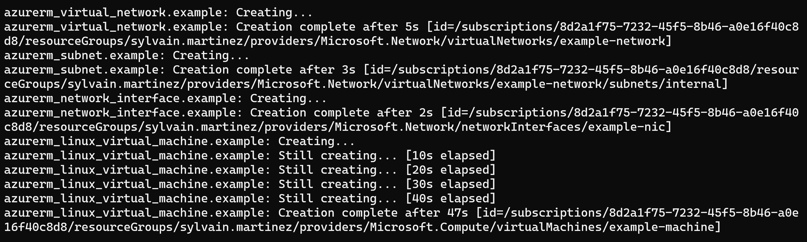

# Create Virtual Machine

Table of Contents
=================

* [Lab overview](#lab-overview)
  * [Objectives](#objectives)
  * [Instructions](#instructions)
    * [Before you start](#before-you-start)
    * [Exercise 1: Deploy an Azure Virtual Machine](#exercise-1-deploy-an-azure-virtual-machine)
    * [Exercise 3: Remove resources](#exercise-3-remove-resources)

## Lab overview

In this lab, you will learn how to deploy an Azure Virtual Machine.

## Objectives

After you complete this lab, you will be able to:

-   Deploy an Azure Virtual Machine
-   Understand how terraform manage dependencies

## Instructions

### Before you start

- Ensure Terraform (version >= 1.0.0) is installed and available from system's PATH.
- Ensure Azure CLI is installed.
- Check your access to the Azure Subscription and Resource Group provided for this training.
- Your environment is setup and ready to use from the lab *Setup environment*

### Exercise 1: Deploy an Azure Virtual Machine

In the *main.tf* file, add the following **data** block to reference your Storage Account

```hcl
data "azurerm_resource_group" "training_rg" {
  name = "yourresourcegroupname"
}
```

> Since this Resource Group has been created outside of Terraform, we will use a data block to retrieve its configuration.

> No change will be done on this Resource Group, this template does not manage its lifecyle.

Add the following blocks to create a Virtual Machine

```hcl
resource "azurerm_linux_virtual_machine" "training_vm" {
  name                = "training-vm"
  resource_group_name  = data.azurerm_resource_group.training_rg.name
  location            = "westeurope"
  size                = "Standard_B2s"
  admin_username      = "adminuser"
  admin_password      = "P@ssword01!!"
  disable_password_authentication = false
  network_interface_ids = [
    azurerm_network_interface.training_vm_nic.id,
  ]

  os_disk {
    caching              = "ReadWrite"
    storage_account_type = "Standard_LRS"
  }

  source_image_reference {
    publisher = "canonical"
    offer     = "0001-com-ubuntu-server-jammy"
    sku       = "22_04-lts-gen2"
    version   = "latest"
  }
}

resource "azurerm_network_interface" "training_vm_nic" {
  name                = "nic-training-vm"
  location            = "westeurope"
  resource_group_name  = data.azurerm_resource_group.training_rg.name

  ip_configuration {
    name                          = "internal"
    subnet_id                     = azurerm_subnet.training_vm_subnet.id
    private_ip_address_allocation = "Dynamic"
  }
}

resource "azurerm_subnet" "training_vm_subnet" {
  name                 = "internal"
  resource_group_name  = data.azurerm_resource_group.training_rg.name
  virtual_network_name = azurerm_virtual_network.traing_vnet.name
  address_prefixes     = ["10.0.2.0/24"]
}

resource "azurerm_virtual_network" "traing_vnet" {
  name                = "vnet-training"
  address_space       = ["10.0.0.0/16"]
  location            = "westeurope"
  resource_group_name = data.azurerm_resource_group.training_rg.name
}
```

In this template, resources are intentionally in the wrong order.

Terraform resource creation order is determined using implicit and explicit dependencies (using the attribute *depends_on* - https://www.terraform.io/docs/language/meta-arguments/depends_on.html)


Open a new shell and run the following commands:

```powershell
az login
$env:ARM_SUBSCRIPTION_ID="[Id of the provided training subscription]"
terraform init -backend-config=".\configuration\dev-backend.hcl"
terraform plan
```

The plan is indicating for resource to create

- azurerm_linux_virtual_machine
- azurerm_network_interface
- azurerm_subnet
- azurerm_virtual_network

Run the apply command

```powershell
terraform apply
```

Confirm the creation, approving with *yes*



Use the Azure portal to confirm resources creation

### Exercise 3: Remove resources

Run the destroy command

```powershell
terraform destroy
```

Confirm the deletion, approving with *yes*

> For apply and destroy command, you can add the -auto-approve to the command line the avoid validaton

Use the Azure portal to confirm resources deletion

