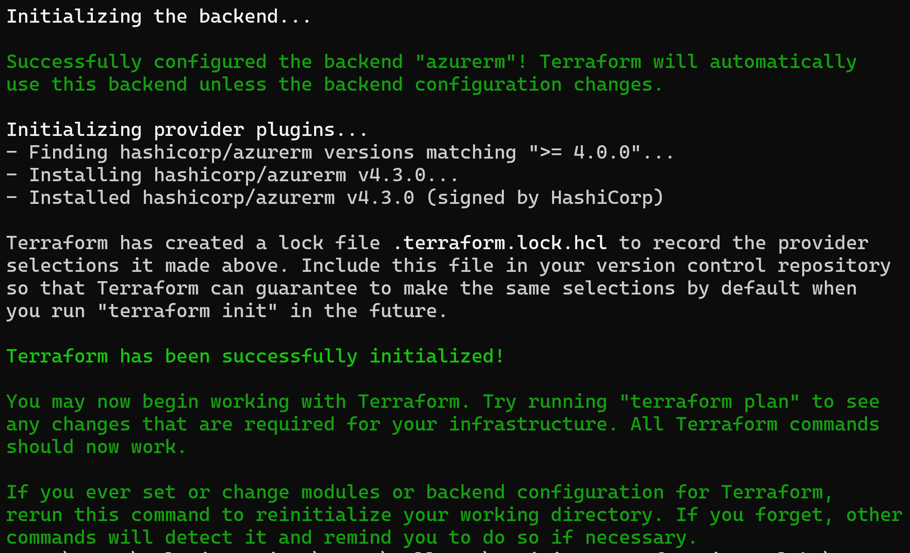

# Setup environment

Table of Contents
=================

* [Lab overview](#lab-overview)
* [Objectives](#objectives)
* [Instructions](#instructions)
  * [Before you start](#before-you-start)
  * [Exercise 1: Create a Storage Account and a Container](#exercise-1-create-a-storage-account-and-a-container)
  * [Exercice 2: Setup the template configuration](#exercice-2-setup-the-template-configuration)
    * [Create the configuration file](#create-the-configuration-file)
    * [Terraform init](#terraform-init)
  * [Exercice 3: Conventions](#exercice-3-conventions)
  * [Exercice 4: Make it more dynamic](#exercice-4-make-it-more-dynamic)
    * [Use an environment variable to select the subscription](#use-an-environment-variable-to-select-the-subscription)
    * [Use partial backend configuration](#use-partial-backend-configuration)

## Lab overview

In order to deploy infrastructure with Terraform some configuration is mandatory, without considering the resources themselfs. This configuration is about:

- **Authentication**: Terraform needs to handle authentication to the Azure Cloud API.

- **Backend**: Terraform use a backend file, called tfstate. This file is used to map real world resources to the configuration template. It is mandatory for Terraform.

- **Providers**: Providers are plugins used to interact with Cloud Providers APIs.

In this lab, you will learn how to setup this three aspects in a new Terraform template.

## Objectives

After you complete this lab, you will be able to:

-   Setup a new Terraform project

## Instructions

### Before you start

- Ensure Terraform (version >= 1.0.0) is installed and available from system's PATH.
- Ensure Azure CLI is installed.
- Check your access to the Azure Subscription and Resource Group provided for this training.

### Exercise 1: Create a Storage Account and a Container

In order to store the Terraform tfstate file, we're going to use a Blob Storage.

By default, Terraform will create this file locally, in a file named *terraform.tfstate*. This file contains informations on real world infrastructure, including sensible data (for instance, Virutal Machines admin account password). There are reasons why this option should be disregared

- Templates should be commited to a source code repository, and should not contains sensible data.
- A deployment should be required when the author of the template is on vacation, collaborative work should be the norm.
- Using a file in a network share won't protect from collision if there are multiple deployments at the same time

An alternative is to use an Azure Blob storage to store the tfstate :

- tfstate won't be commited in source code.
- Access to the tfstate is managed using RBAC or SAS (Shared Access Signature) token.
- Blob Storage has a lock feature nativelly used by Terraform, protecting from collision in case on multiple deployment at the same time

Create a Storage Account and a container in the Azure Portal

> Terraform will not create this storage and assume it is existing. This should be the unique manual creation when you use Terraform.

> The creation of this storage should be done using AZ CLI, Powershell or the Azure Portal


### Exercice 2: Setup the template configuration

#### Create the configuration file

1. In a local empty folder, create a file named *main.tf*

    > The name of the file has no importance, only its extension. main.tf is only a convention

1. In this file, add the following configuration block

    ```hcl
    terraform {
      required_version = ">= 1.0.0"
    }
    ```

    The *required_version* setting allows to set a version constraint on the installed Terraform version.

1. In the terraform configuration block add the backend configuration using information on the Storage Account you created previously:

    ```hcl
    backend "azurerm" {
      resource_group_name  = "name of the Resource Group of the Storage Account you created"
      storage_account_name = "name of the Storage Account you created"
      container_name       = "Name of the container you created"
      key                  = "training.tfstate"
    }
    ```

    > There are multiple type of backend that might be used. All majors Cloud Providers have their own (s3 for AWS, gcs for GCP,... )

    > This configuration is valid for an authentication using AZ CLI. If you're using a Service Principal or a Managed Identity, additionnal fields may be mandatory. https://developer.hashicorp.com/terraform/language/backend/azurerm

1. In the terraform configuration block add the provider requirements:

    ```hcl
    required_providers {
      azurerm = ">= 4.0.0"
    }
    ```

    We can set here a version constraint on the provider

1. Add a provider block for the azurerm provider

    ```hcl
    provider "azurerm" {
      resource_provider_registrations = "none"
      features {}
      subscription_id = "Id of the provided subscription"
    }
    ```

    The configuration of the azurerm provider:
    - **resource_provider_registrations**: Set of Azure Resource Providers to automatically register when initializing the AzureRM Provider
    - **feature**: List of features that might be activated on the provider
    - **subscription_id**: The Id of the subscription

    > All the available settings can be found here - https://registry.terraform.io/providers/hashicorp/azurerm/latest/docs

The full content of the file should be

```hcl
terraform {
  required_version = ">= 1.0.0"

  backend "azurerm" {
    resource_group_name  = "name of the Resource Group of the Storage Account"
    storage_account_name = "name of the Storage Account"
    container_name       = "Name of the container"
    key                  = "training.tfstate"
  }

  required_providers {
    azurerm = ">= 4.0.0"
  }
}

provider "azurerm" {
  resource_provider_registrations = "none"
  features {}
  subscription_id = "Id of the provided subscription"
}
```

> Do not waste time trying to format the template nicelly. Use the 'terraform fmt -recursive' command instead. https://www.terraform.io/docs/cli/commands/fmt.html

#### Terraform init

Once your template is ready, open a new shell and login using AZ CLI

```bash
az login
```

Select the provided training subscription
```
az account set --subscription the_provided_subscription_Id
```

The first terraform command to run once you created your template is

```hcl
terraform init
```

This command has no side effects (ie: It will not modify any resources nor update the tfstate file). It can be run at anytime.

It will
- Intialize the backend
- Download providers



> Look at the .terraform folder to see the installed provider

> Look at your Storage Account, the tfstate is now present in the container


### Exercice 3: Conventions

> This step is not mandatory but will allow you to keep you template readable and maintenable over time. You should adopt this convention as soon as possible

To keep a clean organization in your folder, split the main.tf:

- create a new file named *version.tf* that contains the terraform configuration block
- create a new file named *provider.tf* that contains the provider azurerm block

Run the terraform init command to ensure this refactoring is fine

### Exercice 4: Make it more dynamic

> This step is not mandatory but will allow you to keep you template readable and maintenable over time. You should adopt this convention as soon as possible

Some settings in this template may vary when deploying to different environment:

- the subscription
- the backend configuration (Storage Account, container or key)

#### Use an environment variable to select the subscription

The subscription where deployment should be performed can be sourced from an environment variable, named *ARM_SUBSCRIPTION_ID*.

Using this mechanism allow to keep a template clean from any configuration settings.

Remove the subscription_id from the provider configuration block in the *provider.tf* file. It now should be

```hcl
provider "azurerm" {
  resource_provider_registrations = "none"
  features {}
}
```

Open a new shell session, and run the following commands:

```powershell
az login
$env:ARM_SUBSCRIPTION_ID="Id of the provided training subscription"
terraform init
```

#### Use partial backend configuration

Backend configuration using command line parameters, or stored in an external file. This mechanism is called partial configuration.

> For an overview of partial configuration - https://developer.hashicorp.com/terraform/language/backend#partial-configuration

1. Create a folder called *configuration* and a file named *dev-backend.hcl* in it
1. Copy the content of the backend configuration block in this file. It should be

```hcl
resource_group_name  = "name of the Resource Group of the Storage Account"
storage_account_name = "name of the Storage Account"
container_name       = "Name of the container"
key                  = "training.tfstate"
```
1. Remove the content of backend configuration block, and leave it empty.

```hcl
backend "azurerm" {}
```

We can now set the backend using the CLI option, running the following command:

```bash
terraform init -backend-config=".\configuration\dev-backend.hcl"
```
