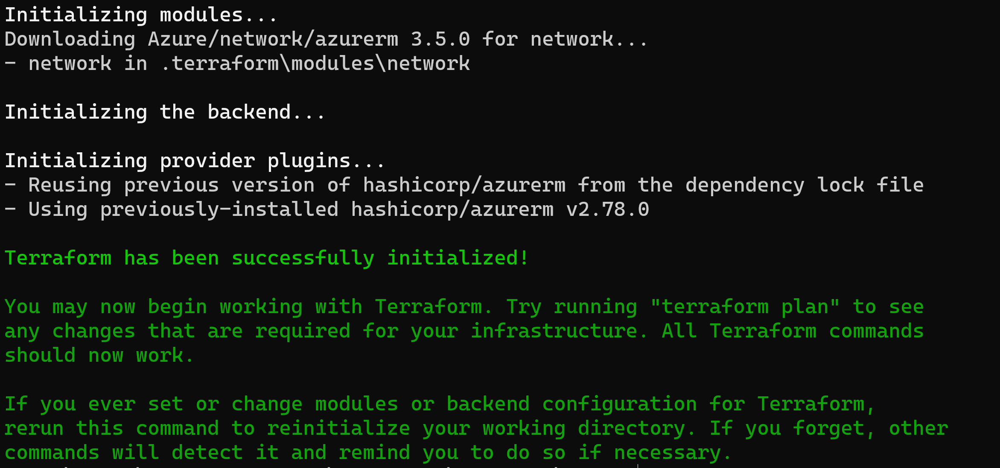

# Setup environment

## Lab overview

In this lab, you will learn how to use module from the gallery.

## Objectives

After you complete this lab, you will be able to:

-   Download a module
-   Instantiate resources from a module

## Instructions

### Before you start

- Ensure Terraform (version >= 1.0.0) is installed and available from system's PATH.
- Ensure Azure CLI is installed.
- Check your access to the Azure Subscription and Resource Group provided for this training.
- Your environment is setup and ready to use from the lab *Setup environment*

### Exercise 1: Download a module

In the *main.tf* file, add the following **data** block to reference your Storage Account

```hcl
data "azurerm_resource_group" "training-rg" {
  name = "yourresourcegroupname"
}
```

> Since this Resource Group has been created outside of Terraform, we will use a data block to retrieve its configuration.

> No change will be done on this Resource Group, this template does not manage its lifecyle.

Add the following blocks to reference a module from the gallery

```hcl
module "network" {
  source              = "Azure/network/azurerm"
  resource_group_name = data.azurerm_resource_group.training-rg.name
  address_spaces      = ["10.0.0.0/16", "10.2.0.0/16"]
  subnet_prefixes     = ["10.0.1.0/24", "10.0.2.0/24", "10.0.3.0/24"]
  subnet_names        = ["subnet1", "subnet2", "subnet3"]
}
```

> The documentation on this module can be found at https://registry.terraform.io/modules/Azure/network/azurerm/latest

> Module download is done when terraform init is run. If you add a module in your template, run terraform init to download it.

Open a new shell and run the following commands:

```powershell
az login
$env:ARM_SUBSCRIPTION_ID="[Id of the provided training subscription]"
terraform init -backend-config=".\configuration\dev-backend.hcl"
```



> The downloaded module can be found in the .terraform folder

### Exercise 2: instantiate a module

run the following commands:

```powershell
terraform plan
```

```powershell
terraform apply
```

Confirm the creation, approving with *yes*

Use the Azure portal to confirm resources creation

### Exercise 3: Remove resources

Run the destroy command

```powershell
terraform destroy
```

Confirm the deletion, approving with *yes*

> For apply and destroy command, you can add the -auto-approve option to the command line the avoid validaton

Use the Azure portal to confirm resources deletion

